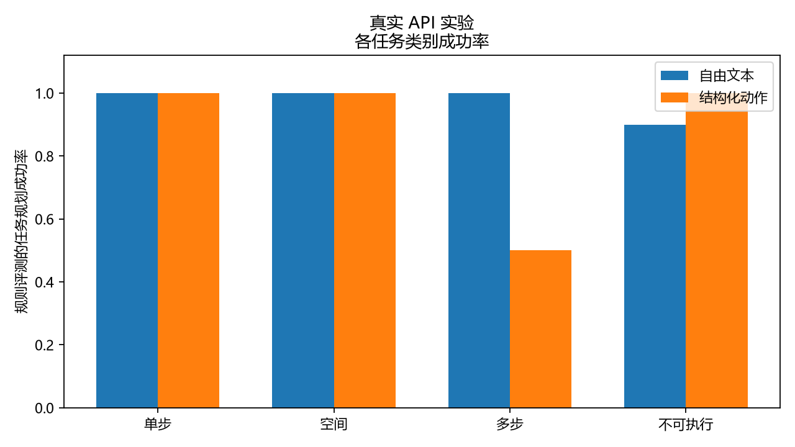

# VLM-Planning-Test

**轻量级评测视觉语言模型在桌面具身任务规划中的表现。**

本项目研究一个简单问题：**Structured Action Prompting 是否能提高 VLM 任务规划的可靠性？**

| 项目 | 设置 |
|---|---|
| 当前 Benchmark | 3.1：10 个真实桌面场景、40 条任务 |
| 对比方法 | Free-form Prompt vs Structured Action Prompt |
| 真实 VLM | 阿里云百炼 `qwen3-vl-plus` |
| 实验规模 | 40 个任务 × 2 种提示，共 80 次 API 调用 |
| Benchmark 3.1 真实结果 | Free-form **97.5%**；Structured **87.5%**；Overall **92.5%** |

这是一个小规模探索性评测项目。它测试“桌面图片 + 中文指令 → 动作计划”，不训练新模型，也不控制真实机器人。

## Main Results

Benchmark 3.1 的正式结果保存在 [`results/run_20260905_210917`](results/run_20260905_210917)。80 个任务/提示组合均取得真实模型回答；一次 `incomplete_response` 通过断点续跑成功补齐，因此服务商实际收到 81 次调用。

| Prompt | Planning Accuracy | Action Validity | Format Compliance | Object Hallucination Rate ↓ |
|---|---:|---:|---:|---:|
| Free-form | **97.5%** | 97.5% | 100.0% | 1.23% |
| Structured | **87.5%** | 100.0% | 100.0% | 0.0% |
| Overall | **92.5%** | 98.75% | 100.0% | 0.62% |



### Visual Dependence Controls

| 图片条件 | Overall | Single-step | Spatial | Multi-step | Impossible |
|---|---:|---:|---:|---:|---:|
| 正确图片 | **92.50%** | 100.00% | 100.00% | 75.00% | 95.00% |
| 无图片 | **48.75%** | 65.00% | 45.00% | 50.00% | 35.00% |
| 错配图片 | **12.50%** | 35.00% | 0.00% | 5.00% | 10.00% |

正确图片相对无图片提高 43.75 个百分点，相对错配图片提高 80.00 个百分点。结果说明模型答案显著依赖视觉输入；由于只有 10 个场景和二维左右关系，它不能证明模型具备完整空间理解。完整分析见 [`实验报告_20260905_Benchmark3.1.md`](实验报告_20260905_Benchmark3.1.md)。

Structured 的 5 个规划失败都出现在 Multi-step 的 `else` 分支：模型输出了格式正确、动作合法但方向相反的计划。这表明结构化格式保证了可解析性，却没有保证模型根据图片选择正确条件分支。Free-form 的唯一失败是把图片中不存在的笔识别为存在。

完整逐任务输出、汇总和失败案例见：

- [`raw_results.json`](results/run_20260905_210917/raw_results.json)
- [`summary.json`](results/run_20260905_210917/summary.json)
- [`failure_cases.json`](results/run_20260905_210917/failure_cases.json)

Benchmark 2.1 的历史基线为 Free-form 80.0%、Structured 97.5%、Overall 88.75%，保存在 [`results/run_20260904_161430`](results/run_20260904_161430)。2.1 与 3.1 的任务设计不同，不能把数字直接当作同一实验的重复测量。详细研究过程见 [`问题与改进记录.md`](问题与改进记录.md)。

## Benchmark

当前 Benchmark 3.1 仍包含 **10 张真实照片 × 每张 4 条任务 = 40 条任务**。每个场景各有一条：

- Single-step：图片中存在目标时拿起它；
- Spatial：根据图片中的初始左右关系选择放置方向；
- Multi-step：根据初始关系选择分支，再连续完成放置和抓取；
- Impossible：同一目标在另一张图片中不存在，此时输出 `INVALID_TASK`。

任务使用纸巾、鼠标、笔、橡皮、眼镜、饮料瓶、雨伞和计算器等日常物体。同一张图片可以对应多条指令。四类任务都采用反事实配对，避免文字唯一决定答案：

- 10 条 Single-step 与 10 条 Impossible 组成 10 组存在性对照。同一句“如果图片中有该物体就拿起，否则拒绝”分别配一张存在目标和一张缺少目标的图片。
- 10 条 Spatial 组成 5 组条件空间对照。同一句指令在两张图片中触发相反的 `PLACE_LEFT` / `PLACE_RIGHT` 分支。
- 10 条 Multi-step 组成另外 5 组条件空间对照，图片同时决定放置方向，计划还必须完成后续抓取。

因此，任何一类任务都不能仅根据指令文字确定唯一 Ground Truth。模型仍可能利用数据规律猜测，所以是否真正依赖图片还需要 `text_only` 和 `shuffled` 对照实验。

| 场景 | 从左到右的物体 |
|---|---|
| `scene_01` | 纸巾、鼠标、笔、橡皮 |
| `scene_02` | 眼镜、饮料瓶、雨伞、计算器 |
| `scene_03` | 鼠标、橡皮、眼镜、饮料瓶 |
| `scene_04` | 笔、计算器、纸巾、雨伞 |
| `scene_05` | 饮料瓶、纸巾、鼠标、眼镜 |
| `scene_06` | 雨伞、笔、橡皮、计算器 |
| `scene_07` | 计算器、眼镜、饮料瓶、笔 |
| `scene_08` | 橡皮、雨伞、纸巾、鼠标 |
| `scene_09` | 纸巾、眼镜、计算器、橡皮 |
| `scene_10` | 鼠标、饮料瓶、笔、雨伞 |

[`data/scenes.json`](data/scenes.json) 记录场景物体和空间关系，[`data/tasks.json`](data/tasks.json) 记录指令、类别、标准动作与目标状态。照片已经人工核对并登记 SHA-256；图片发生变化时，真实实验会要求重新核对。

## Method

```text
桌面图片 + 中文指令
        ↓
同一个 VLM，分别使用 Free-form / Structured Prompt
        ↓
模型原始输出
        ↓
规则解析 + 动作前提检查 + 目标状态模拟
        ↓
逐任务结果、汇总指标与失败案例
```

模型只能看到图片和指令。场景物体清单、任务类别、标准答案和目标状态只用于评测，不会发给模型。

Free-form 模式允许模型用限定的中文句式给出最终计划。Structured 模式要求模型只输出以下动作：

```text
PICK(object)
PLACE_LEFT(object, target)
PLACE_RIGHT(object, target)
PLACE_IN(object, container)
INVALID_TASK
```

两种方法使用相同模型、图片、任务、温度（0）和 token 上限（512），请求顺序按固定随机种子 42 打乱。任务还保存物体存在性或条件空间判断、所选分支、移动物体、目标物体和方向，失败时可区分 `wrong_existence_decision`、 `wrong_moved_object`、`wrong_target_object`、`wrong_direction` 与 `wrong_condition_branch`。

## Evaluation Metrics

项目使用透明、可复现的规则，不使用黑盒评分器，也不把字符串完全相等作为唯一标准。

| 指标 | 定义 |
|---|---|
| **Task Planning Success** | 动作合法，并通过状态模拟达到任务目标；Impossible 任务必须只输出 `INVALID_TASK` |
| **Action Validity** | 动作能完整解析，且动作类型、参数、物体和夹爪状态都合法 |
| **Object Hallucination Rate** | 对不存在物体的引用数 ÷ 全部已解析物体引用数 |
| **Format Compliance** | 输出能被对应模式的公开规则完整解析，没有未识别内容 |

## Quick Start

需要 Python 3.10 或更高版本。本项目在 Python 3.12 下验证。

```powershell
py -m venv .venv
.\.venv\Scripts\python.exe -m pip install -r requirements.txt
.\.venv\Scripts\python.exe -m pytest -q
.\.venv\Scripts\python.exe validate_benchmark.py --require-verified
.\.venv\Scripts\python.exe demo.py --backend mock --task-id task_002
.\.venv\Scripts\python.exe run_evaluation.py --backend mock --category spatial
```

Mock backend 读取标准答案，只用于检查程序流程，不代表真实模型能力。

运行真实 VLM 前，将 `.env.example` 复制为 `.env`，填写自己的阿里云百炼 API Key：

```dotenv
VLM_API_KEY=
VLM_BASE_URL=https://dashscope.aliyuncs.com/compatible-mode/v1
VLM_MODEL=qwen3-vl-plus
```

```powershell
# 只检查配置，不调用 API
.\.venv\Scripts\python.exe run_evaluation.py --backend real --dry-run

# Benchmark 3.1 完整主实验：40 个任务 × 2 种提示模式 = 80 次调用
.\.venv\Scripts\python.exe run_evaluation.py --backend real

# 最小空间视觉依赖对照：每条命令 20 次调用
.\.venv\Scripts\python.exe run_evaluation.py --backend real --category spatial --image-condition text_only
.\.venv\Scripts\python.exe run_evaluation.py --backend real --category spatial --image-condition shuffled

# 如需检查全部四类任务，去掉 --category spatial；每条命令为 80 次调用

# 查看保存的结果
.\.venv\Scripts\python.exe show_results.py
```

完整主实验需要 80 次调用；两个可选空间对照合计再增加 40 次。每次真实运行会创建独立的 `results/run_YYYYMMDD_HHMMSS/` 目录。程序逐条保存 checkpoint；中断后可使用 `--resume 结果目录` 继续，已经成功的任务不会再次请求 API。`.env` 已被 Git 忽略，API Key 不会写入结果文件。

## Project Structure

```text
data/                  场景照片、场景元数据和 40 条任务
results/               正式实验、历史实验和 mock 检查结果
src/benchmark.py       数据生成与一致性校验
src/prompts.py         两种提示方法
src/vlm.py             Mock 与真实 VLM 接口
src/parser.py          结构化动作和中文计划解析
src/evaluator.py       动作检查、状态模拟与指标计算
tests/                 无需真实 API 的自动化测试
demo.py                单条任务演示
run_evaluation.py      批量实验、重试、断点续跑与结果保存
show_results.py        在终端展示实验汇总
```

## Failure Analysis

Benchmark 3.1 共出现 6 个规划失败：

- 5 个 Structured Multi-step 任务选择了错误方向和条件分支；
- 1 个 Free-form Impossible 任务把不存在的笔判断为存在，产生物体幻觉。

5 个 Structured 错误全部发生在成对设计中的 `else` 场景，而对应的 `if` 场景成功。这是系统性的视觉条件判断失败，不是输出格式错误。逐条原始回答保存在正式结果目录，可直接复核。

Benchmark 2.1 及更早结果保留用于记录任务设计和评测规则的演变，不使用3.1规则覆盖或重算旧实验数字。

## Limitations

- 40 条任务只来自 10 个场景，规模较小，也不能视为 40 个独立视觉场景。
- 每个任务只运行一次，尚未测量模型输出的随机波动。
- Structured Prompt 天然更容易解析，因此结果同时报告格式合规率，并保留原始输出供人工检查。
- Free-form 解析器只支持公开的有限句式，正常但未收录的表达可能被判为格式错误。
- 符号模拟器不模拟碰撞、可达性、物理尺寸或真实机器人轨迹。
- 当前结果只来自 `qwen3-vl-plus`，不能代表其他 VLM。

## Future Work

- 扩展更多相互独立的场景和物体类别；
- 对同一设置进行多次重复实验，分析结果稳定性；
- 在更多场景和重复运行中复核 `text_only` / `shuffled` 视觉依赖结论；
- 研究更长、更复杂的多步任务规划。